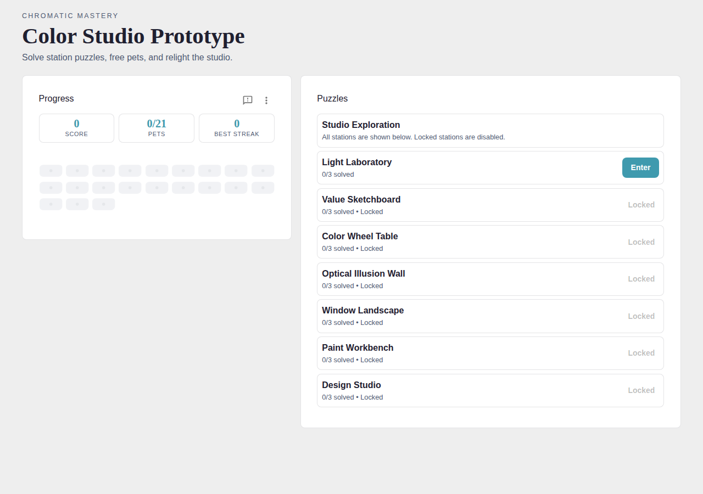
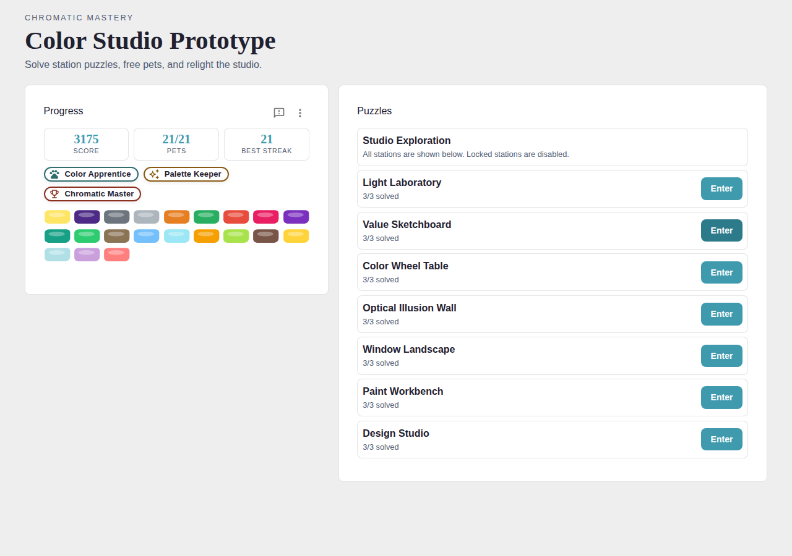
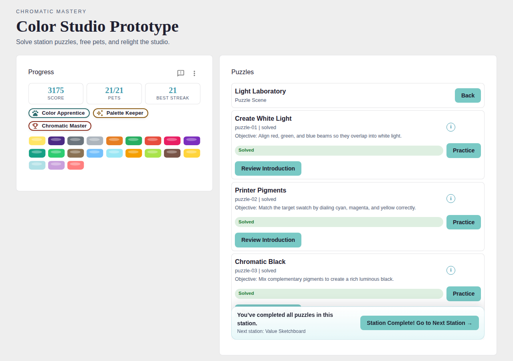
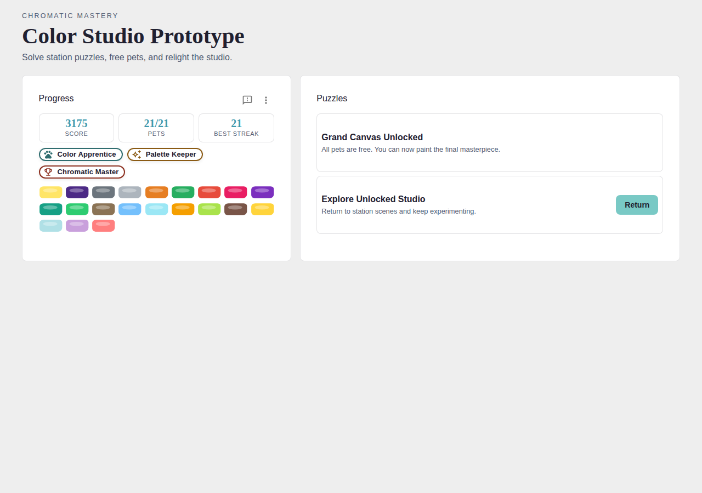

# Chromatic Mastery

**A cozy browser puzzle game that teaches colour theory through 21 interactive challenges.**

Explore a magical artist's studio where the fundamental forces of colour have been captured inside puzzle machines. Solve each puzzle to free a Chromatic Pet and relight the studio.

[](LICENSE)
[](https://www.typescriptlang.org/)
[](https://react.dev/)
[](https://vitejs.dev/)
[](https://leejsinclair.github.io/colour-theory-game/)

> 🎮 **[Play Chromatic Mastery now →](https://leejsinclair.github.io/colour-theory-game/)**

---

## Screenshots

| Studio — Start | Studio — Completed |
|---|---|
|  |  |

| Light Laboratory puzzles | Grand Canvas unlocked |
|---|---|
|  |  |

---

## What is Chromatic Mastery?

Chromatic Mastery is a colour-theory education game built around a single question: *what do you actually need to know to paint and design with confidence?*

The player takes the role of a visitor to a forgotten Colour Studio. All 21 Chromatic Pets are trapped inside puzzle machines. Freeing each one requires understanding a specific principle of colour:

| # | Station | Colour Principles Covered |
|---|---|---|
| 1 | **Light Laboratory** | RGB additive mixing, CMY subtractive mixing, chromatic black |
| 2 | **Value Sketchboard** | Squint test, value ladder, chroma-tree |
| 3 | **Color Wheel Table** | Complementary pairs, triadic harmony, mood palettes |
| 4 | **Optical Illusion Wall** | Simultaneous contrast, grey shifts, neutral pop |
| 5 | **Window Landscape** | Atmospheric perspective, Rayleigh scattering, time-of-day palettes |
| 6 | **Paint Workbench** | Vibrant green pairing, mud prevention, optical mixing |
| 7 | **Design Studio** | 60/30/10 rule, emotional colour mapping, chromatic vibration |

Solving all 21 puzzles across the 7 stations unlocks the **Grand Canvas** — the final painting challenge that tests overall mastery.

---

## Getting Started

### Prerequisites

- [Node.js](https://nodejs.org/) 18 or later
- npm (bundled with Node.js)

### Install

```bash
git clone https://github.com/leejsinclair/colour-theory-game.git
cd colour-theory-game
npm install
```

### Play in the browser

```bash
npm run play:web
```

Open [http://localhost:5173](http://localhost:5173) in your browser.

### Play in the terminal (CLI prototype)

```bash
npm run play
```

---

## How to Play

1. **Enter a station** — click the **Enter** button next to an unlocked station.
2. **Read the introduction** — each puzzle begins with a short learning card explaining the colour principle.
3. **Solve the puzzle** — interact with the puzzle mini-game (sliders, toggles, pickers, grids) and press **Check**.
4. **Collect the pet** — a correct solution frees the Chromatic Pet for that puzzle and adds it to your progress panel.
5. **Complete the station** — finish all 3 puzzles in a station to unlock the next one.
6. **Unlock the Grand Canvas** — free all 21 pets to paint the final masterpiece.

### HUD buttons

| Button | Description |
|---|---|
| **Options → Auto Solve Journey** | Instantly completes all 21 puzzles (demo / tour mode) |
| **Options → Reset Run** | Clears all progress and restarts from the beginning |
| **Send Feedback** | Opens the feedback form |

---

## Tech Stack

| Layer | Technology |
|---|---|
| Language | TypeScript 5.8 (strict) |
| UI framework | React 19 + Emotion |
| Component library | MUI 7 |
| Build tool | Vite 6 |
| Unit tests | Vitest |
| End-to-end tests | Playwright |
| Linting | ESLint + @typescript-eslint |
| Git hooks | Husky |

---

## Scripts

```bash
npm run play:web      # Launch browser game (Vite dev server)
npm run play          # Launch CLI prototype

npm test              # Run unit tests
npm run test:e2e      # Run Playwright end-to-end tests
npm run test:cloud    # Full CI pipeline: build → unit → e2e

npm run build         # Compile TypeScript
npm run build:web     # Production web build (outputs dist/)

npm run lint          # Check ESLint rules
npm run lint:fix      # Auto-fix ESLint issues
```

---

## Project Structure

```
colour-theory-game/
├── src/
│   ├── content/        # Puzzle definitions, learning content, demo solutions
│   ├── entities/       # Player, Pet, Puzzle, Station classes
│   ├── game/           # Core game loop (Game, SceneManager, PlayerController)
│   ├── systems/        # PuzzleManager, PetManager, ColorEngine, SaveSystem
│   ├── types/          # Shared TypeScript enums and interfaces
│   └── web/            # React components and per-puzzle mini-game UIs
├── tests/
│   ├── game.test.ts    # Unit tests
│   └── e2e/            # Playwright end-to-end tests
├── public/
│   └── puzzle-info/    # Per-puzzle markdown learning cards (puzzle-01.md … puzzle-21.md)
└── index.html
```

---

## Contributing

Contributions are welcome! Please read [CONTRIBUTING.md](CONTRIBUTING.md) for guidelines on how to report bugs, suggest improvements, and submit pull requests.

Use the in-game **Send Feedback** button or open the feedback form directly:  
👉 https://form.jotform.com/260802651069052

---

## License

This project is released under the [MIT License](LICENSE) — free to use, modify, and distribute.
